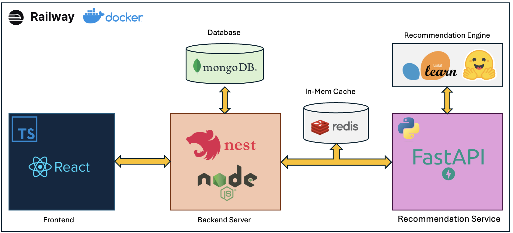
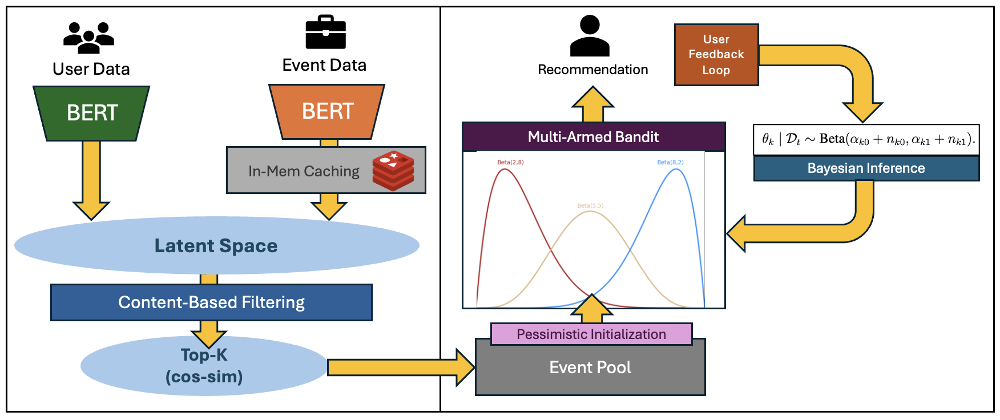

# Pango

## Why Pango
Pango is our intuitive, gamified app that connects users to volunteering opportunities tailored to their location, preferences and skills. With Pango, giving back to the community becomes easier and more enjoyable.

## Tech Stack
- Frontend: React.js, Typescript
- Backend: Nest.js, Node.js, FastAPI, Python
- Databases: MongoDB, Redis
- Machine Learning: SkLearn, HF-Transformers

## Features

### RPG-Like Gamified Volunteering

- Mobile-first web application, meaning users can interact with our application directly from their phone browsers without consuming disk space on their phone.

- Systems such as achievements and EXP bridge a community and bring users together.

- GPS/Map system for users to find volunteering locations across the island.

### Volunteer-Event Matching

We designed a multistep recommendation process, starting with content-based filtering with BERT to generate an initial pool of candidates. In-mem caching speeds inference up to log-linear complexity.

Due to lack of user data to train scoring models, we treat promotion from candidates as a Multi-Armed Bandit with a pessimistic prior, solving it via Bayesian Inference. This allows:

- the algorithm to update itself and adapt to user response.
- the algorithm to balance between explore-exploit dilemma.
- the algortihm to remain robust to feedback delays due to it's stochastic nature.

